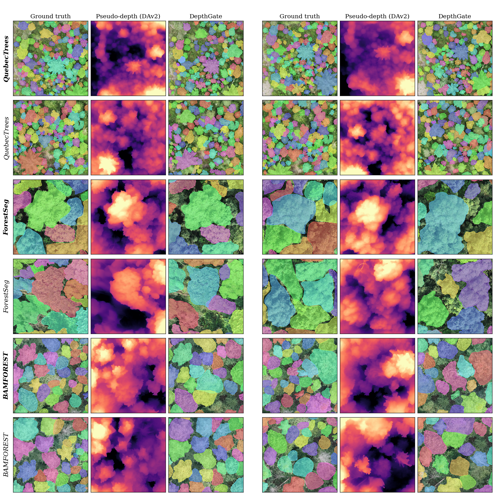
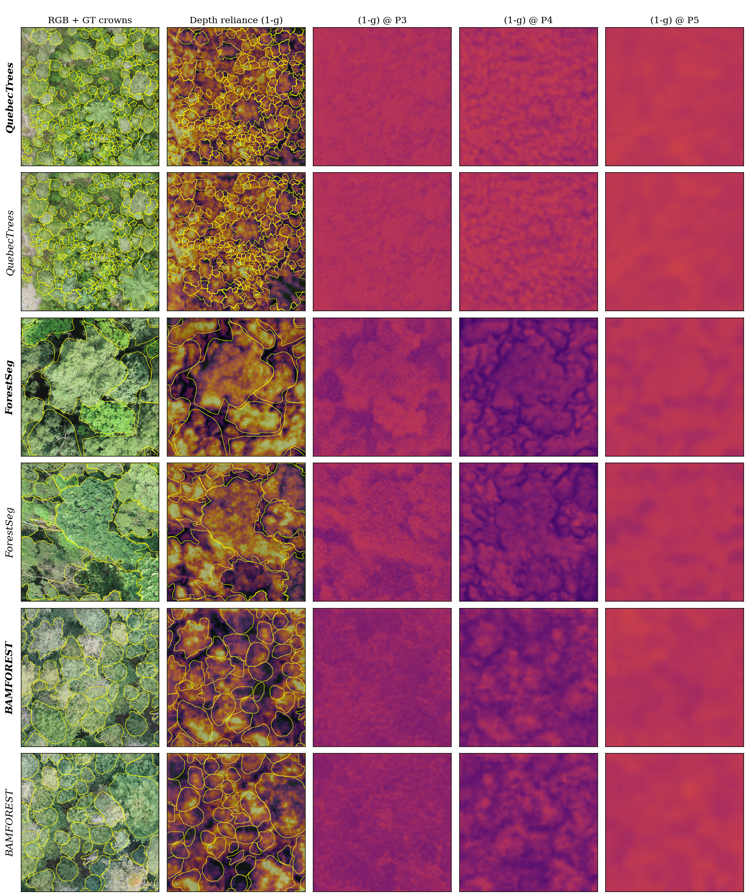

# Pseudo-Depth for Instance Tree-Crown Segmentation

**DepthGate**: depth-gated feature fusion for tree-crown instance segmentation
from RGB aerial imagery.

Adjacent tree crowns often look alike in RGB, so instance segmentation models
tend to merge touching crowns or split one crown into several. DepthGate adds
**monocular pseudo-depth** from [Depth Anything V2](https://github.com/DepthAnything/Depth-Anything-V2)
(DAv2) as a second input. No LiDAR or extra sensors are needed. A lightweight
depth encoder produces multi-scale depth features. At several FPN levels of
Mask2Former, a learned per-pixel gate decides how much to trust RGB and how
much to trust depth.

<p align="center">
  
</p>

## Highlights

- **Plug-in module.** Wraps MMDetection's `Mask2Former`. The RGB backbone,
  pixel decoder and transformer decoder are left unchanged.
- **Pseudo-depth only.** Depth maps are generated offline from the RGB tiles
  with DAv2. MiDaS and ZoeDepth are also supported.
- **Interpretable gating.** The per-level gate `g` and depth attention `α` are
  logged during training and can be visualised as heatmaps.
- **Full ablation suite.** Covers fusion mechanisms, FPN levels, encoder
  capacity, gate initialisation, depth source, and robustness to noisy or
  missing depth.
- **Three datasets.** BAMFOREST, QuebecTree and ForestSeg-T1.

## Method

<p align="center">
  
</p>

A frozen, lightweight CNN `DepthEncoder` maps the single-channel depth map to
features at strides {4, 8, 16, 32}. For each fused level (P3, P4 and P5 by
default), `DepthGate` combines the RGB feature `F_rgb` with the depth feature
`F_d`:

```
g     = σ( MLP([F_rgb ; F_d]) )        # per-pixel gate: trust in RGB
α     = σ( MLP(F_d) )                  # depth attention (ridges / crown edges)
F_out = g · F_rgb + (1 − g) · (α · F_d)
```

- The last conv of the gate MLP is zero-initialised, so training starts at
  `g ≈ 0.5` (equal trust in both inputs).
- P2 (stride 4) is skipped by default so that high-frequency DAv2 noise is not
  amplified. Change this with `fuse_levels`.
- Depth is min-max normalised per tile to `[0, 1]` when loaded. DAv2 output is
  relative (affine-invariant), not metric.

The same model class (`Mask2FormerDepthGate`) also implements these baseline
fusions for the ablations: `concat`, `sum`, `film` (FiLM) and `se`
(depth-driven SE). `Mask2FormerRGBD` implements early fusion: depth is fed as a
4th input channel through an inflated ResNet stem.

## Repository layout

```
.
├── depthgate/                     # custom package, registered with MMDet
│   ├── depth_gate.py              # DepthEncoder + DepthGate
│   ├── fusions.py                 # Concat / Sum / FiLM / SE fusion baselines
│   ├── mask2former_depthgate.py   # Mask2Former + pluggable RGB-depth fusion
│   ├── mask2former_rgbd.py        # early-fusion RGB-D baseline (4-ch stem)
│   ├── dataset.py                 # DepthCocoDataset + depth transforms
│   └── hooks.py                   # LogDepthGateHook (logs gate/alpha per level)
├── configs/
│   ├── _base_.py                              # shared schedule / pipeline
│   ├── mask2former_r50_{bamforest,quebectree,forestseg}.py            # RGB baselines
│   ├── mask2former_r50_depthgate_{bamforest,quebectree,forestseg}.py  # DepthGate
│   └── ablations/                             # see docs/ABLATIONS.md
├── tools/
│   ├── train.py / test.py         # training and evaluation entry points
│   ├── generate_depth.py          # DAv2 / MiDaS / ZoeDepth → <stem>_depth.npy
│   ├── quebectree_to_coco.py      # YOLO-seg → COCO
│   ├── forestseg_to_coco.py       # LabelMe → COCO
│   ├── boundary_ap.py             # Boundary-IoU AP (Cheng et al., CVPR 2021)
│   ├── depth_error_diagnostic.py  # "are baseline errors depth-resolvable?"
│   ├── get_flops.py / bench_dav2_fps.py
│   ├── visualize.py / visualize_image.py / plot_gate_alpha.py
│   ├── run_ablations.sh           # runs the full ablation study
│   ├── eval/                      # aggregation, touching-crown, per-size,
│   │                              # robustness, gate analysis, qualitative figs
│   └── chm/                       # pseudo-depth vs. canopy height model study
├── docs/ABLATIONS.md              # step-by-step ablation and evaluation guide
├── prediction_viz/                # qualitative figures
└── evaluate_gate_val/             # gate-distribution figures
```

## Installation

> Do **not** use `mim install`. Recent versions try to resolve broken legacy
> packages and fail. Install MMEngine, MMCV and MMDetection directly.

```bash
conda create -n depthgate python=3.10 -y
conda activate depthgate

# 1. PyTorch (match your CUDA; example: CUDA 12.1)
pip install torch==2.1.0 torchvision==0.16.0 \
    --index-url https://download.pytorch.org/whl/cu121

# 2. OpenMMLab stack
pip install "mmengine>=0.10.0,<0.11"
pip install "mmcv==2.1.0" \
    -f https://download.openmmlab.com/mmcv/dist/cu121/torch2.1/index.html
pip install "mmdet==3.3.0"

# 3. Remaining dependencies
pip install -r requirements.txt

# 4. Depth generation (DAv2 / ZoeDepth via HF transformers; MiDaS via timm)
pip install transformers timm
```

For other torch/CUDA combinations, pick the matching wheel index from
<https://download.openmmlab.com/mmcv/dist/>.

Check the install:

```bash
python -c "import mmengine, mmcv, mmdet; print(mmengine.__version__, mmcv.__version__, mmdet.__version__)"
# expected: 0.10.x 2.1.0 3.3.0
```

## Data preparation

### 1. Datasets

| Dataset | Source format | Tile size | Converter |
|---|---|---|---|
| BAMFOREST | COCO | 1024 (trained at 768) | – |
| QuebecTree | YOLO-seg | 1024 | `tools/quebectree_to_coco.py` |
| ForestSeg-T1 | LabelMe | 1024 | `tools/forestseg_to_coco.py` |

All datasets use a single class, `tree`.

### 2. Generate pseudo-depth

Run once per split. Each output is a float32 `(H, W)` array named
`<image stem>_depth.npy`:

```bash
python tools/generate_depth.py --model dav2_small \
    --img-dir <data_root>/images/train \
    --out-dir <data_root>/depth_train
python tools/generate_depth.py --model dav2_small \
    --img-dir <data_root>/images/val \
    --out-dir <data_root>/depth_val
```

Supported models: `dav2_small | dav2_base | dav2_large | midas | zoe_n | zoe_k | zoe_nk`.

### 3. Expected layout

Example for QuebecTree:

```
<data_root>/
├── images/{train,val}/<stem>.jpg
├── annotations/instances_{train,val}.json
└── depth_{train,val}/<stem>_depth.npy
```

The depth file stem must match the RGB image stem plus `depth_suffix`
(`_depth` by default). Samples with a missing image or depth file are skipped
when the dataset is built.

> **Set your paths.** The configs contain absolute `data_root` paths. Edit
> `data_root`, `ann_file`, `data_prefix` and `depth_subfolder` in the config
> for each dataset, or override them on the command line with `--cfg-options`.

## Training

```bash
# RGB-only baseline
python tools/train.py configs/mask2former_r50_bamforest.py --amp

# DepthGate
python tools/train.py configs/mask2former_r50_depthgate_bamforest.py --amp

# Other datasets
python tools/train.py configs/mask2former_r50_depthgate_quebectree.py --amp
python tools/train.py configs/mask2former_r50_depthgate_forestseg.py  --amp

# Override any config value
python tools/train.py configs/mask2former_r50_depthgate_bamforest.py --amp \
    --cfg-options train_dataloader.batch_size=2 randomness.seed=0
```

Checkpoints and logs are written to `work_dirs/<config name>/`. The best
checkpoint is selected by `coco/segm_mAP`. `LogDepthGateHook` writes
`gate/L*` and `alpha/L*` to the log. You can plot them with:

```bash
python tools/plot_gate_alpha.py --log-dir <dir with training logs>
```

## Evaluation

```bash
# COCO bbox / segm AP
python tools/test.py configs/mask2former_r50_depthgate_bamforest.py \
    work_dirs/mask2former_r50_depthgate_bamforest/best_*.pth \
    --out work_dirs/mask2former_r50_depthgate_bamforest/results.pkl

# Boundary AP
python tools/boundary_ap.py <val.json> work_dirs/.../results.pkl

# Touching-crown subset (instances that touch at least one other instance)
python tools/eval/touching_crown_eval.py --gt <val.json> --results work_dirs/.../results.pkl

# AP_S / AP_M / AP_L
python tools/eval/per_size_eval.py --gt <val.json> --results work_dirs/.../results.pkl

# Params / FLOPs
python tools/get_flops.py configs/mask2former_r50_bamforest.py \
    configs/mask2former_r50_depthgate_bamforest.py --shape 768 768
```

## Ablations

All ablation configs are in [configs/ablations/](configs/ablations/) and
inherit from the DepthGate BAMFOREST config.

| Group | Configs |
|---|---|
| Fusion | `fusion_concat`, `fusion_sum`, `fusion_film`, `fusion_se`, `fusion_rgbd_early` |
| FPN levels | `levels_p5_only`, `levels_p4_p5`, `levels_all` |
| Depth encoder | `encoder_small`, `encoder_large`, `encoder_unfrozen` |
| Gate init | `gate_init_rgb` |
| Depth source | `depth_zero` (control), `depth_dav2_small`, `depth_midas`, `depth_zoe` |
| Robustness | `robustness_noise`, `robustness_dropout` |

```bash
bash tools/run_ablations.sh headline   # baseline / concat / DepthGate × 3 seeds
bash tools/run_ablations.sh            # everything
bash tools/eval/eval_all.sh            # evaluate all work_dirs → results.md / results.csv
python tools/eval/aggregate_seeds.py work_dirs --out results_meanstd.md
```

[docs/ABLATIONS.md](docs/ABLATIONS.md) has the full protocol, including
test-time robustness sweeps, gate visualisation and qualitative comparisons.

## Results

> Results will be added soon.

| Dataset | Model | AP<sup>mask</sup> | AP<sub>50</sub> | AP<sub>75</sub> | Boundary AP | Touching AP |
|---|---|:-:|:-:|:-:|:-:|:-:|
| BAMFOREST | Mask2Former R50 (RGB) | – | – | – | – | – |
| | + RGB-D concat | – | – | – | – | – |
| | + DepthGate (ours) | – | – | – | – | – |
| QuebecTree | Mask2Former R50 (RGB) | – | – | – | – | – |
| | + DepthGate (ours) | – | – | – | – | – |
| ForestSeg-T1 | Mask2Former R50 (RGB) | – | – | – | – | – |
| | + DepthGate (ours) | – | – | – | – | – |

## Is pseudo-depth a real height signal?

[tools/chm/](tools/chm/) builds a reference canopy height model (CHM) from the
QuebecTree photogrammetric point clouds. It re-tiles the orthomosaic with
georeferencing so that RGB, DAv2 depth, CHM and GT crowns are co-registered.
It then measures how well DAv2 depth agrees with the CHM at three levels: per
pixel, per crown, and on crown-boundary bands. See
[tools/chm/README.md](tools/chm/README.md).

## Visualization

```bash
# Predictions of several models side by side (RGB / RGB-D / DepthGate)
python tools/visualize_image.py --img <image> \
    --model configs/mask2former_r50_forestseg.py:<ckpt>:RGB \
    --model configs/mask2former_r50_depthgate_forestseg.py:<ckpt>:DepthGate \
    --out-dir prediction_viz --score-thr 0.3

# Gate heatmaps for one image
python tools/eval/visualize_gate.py <config> <ckpt> \
    --img <image> --depth <image>_depth.npy --out-dir gate_vis/
```

## Hardware notes

The default configs target a single 16 GB GPU (RTX 4080) with AMP enabled.
If you run out of memory, lower `image_size` (for example to 640) or set
`train_dataloader.batch_size` to 1–2.

## Citation

```bibtex
@misc{pseudodepth_treecrown,
  title  = {Pseudo-Depth for Instance Tree-Crown Segmentation},
  author = {Do, Mai Viet Hoang and others},
  year   = {2026},
  note   = {Code: https://github.com/DoMaiVietHoang/Pseudo-Depth-for-Instance-Tree-Crown-Segmentation}
}
```

## Acknowledgements

Built on [MMDetection](https://github.com/open-mmlab/mmdetection),
[Mask2Former](https://github.com/facebookresearch/Mask2Former) and
[Depth Anything V2](https://github.com/DepthAnything/Depth-Anything-V2).
Boundary AP follows [Boundary IoU](https://github.com/bowenc0221/boundary-iou-api).
